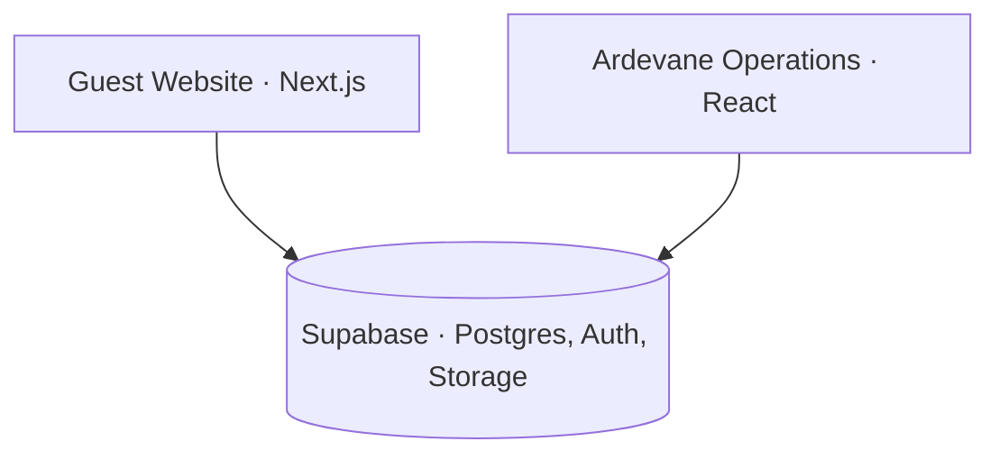

# Ahmed Abouelmagd

Software Engineering student and junior developer. I build web applications, mostly with JavaScript, React and Next.js on the front end, and Laravel or Supabase behind them. I like getting things deployed and keeping them running.

**Mainly working with:** JavaScript · React · Next.js · PHP / Laravel · Supabase · Git / GitHub

## Featured Projects

### Ardevane

A cabin hospitality system made of two connected applications that share one Supabase backend. Guests book and use their stay on the website; staff run the hotel from the dashboard. Both read and write the same database, so a reservation, a check-in or a food order made on one side shows up on the other.

#### [Ardevane Guest Website](https://github.com/ahmedmoh14314-code/ardevane-website)

Guest-facing Next.js app, live at [ardevane.netlify.app](https://ardevane.netlify.app).

- Browse cabins, pick dates on an availability-aware calendar and choose guests
- Review the reservation, then sign in with Google or email to confirm
- Guest account with upcoming, past and cancelled reservations, edit and cancel until the day before arrival
- My Stay: food ordered to the cabin from a menu, housekeeping and maintenance requests, messages to the team, and the stay's charges

*Next.js · React · Supabase*

#### [Ardevane Operations](https://github.com/ahmedmoh14314-code/ardevane-operations)

React dashboard for hotel staff. Also holds the database migrations and tests both apps depend on.

- Today's arrivals, departures, in-house guests and cabin readiness
- Booking lifecycle: approve website requests, walk-in and phone bookings, check-in, checkout, cancel, no-show
- Occupancy calendar, cabin housekeeping condition, guests
- Stay folio with charges and cash payments, and a queue for guest requests
- Staff roles (admin, front desk, housekeeping, maintenance) enforced by row-level security

*React · Vite · Supabase · TanStack Query*

### Other projects

**[Atyaf Al Reem — Case Study](https://github.com/ahmedmoh14314-code/atyaf-al-reem-case-study)**
A platform I built and maintain for a marble business in Riyadh: a public Arabic customer site and an internal management system. Covers the React/Vite → Next.js migration, RTL and mobile-first work, deployment and maintenance. Live at [atyafalreem.com](https://atyafalreem.com).
*Next.js · React · Laravel + Filament · GitHub Actions*

**[Pizzeria Vesuvio](https://github.com/ahmedmoh14314-code/pizzeria-vesuvio)**
A pizza ordering flow: menu, cart, checkout, order tracking.
*React · Redux Toolkit · React Router data APIs · Tailwind*

**[Pinpoint](https://github.com/ahmedmoh14314-code/pinpoint)**
A travel map for saving the cities you have visited. Nested routes, Context with `useReducer`, Leaflet, state kept in the URL.
*React · React Router · Leaflet · CSS Modules*

## Contact

[LinkedIn](https://www.linkedin.com/in/ahmed-abouelmagd-dev/) · ahmed.moh14314@gmail.com
